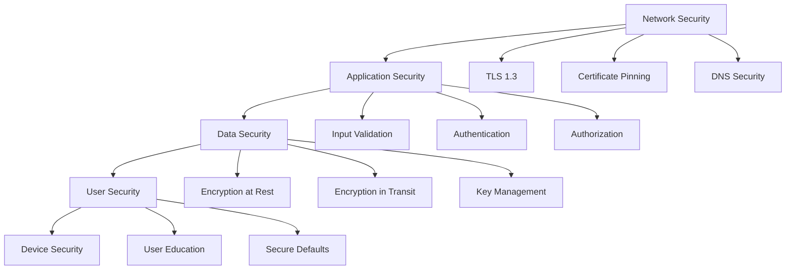
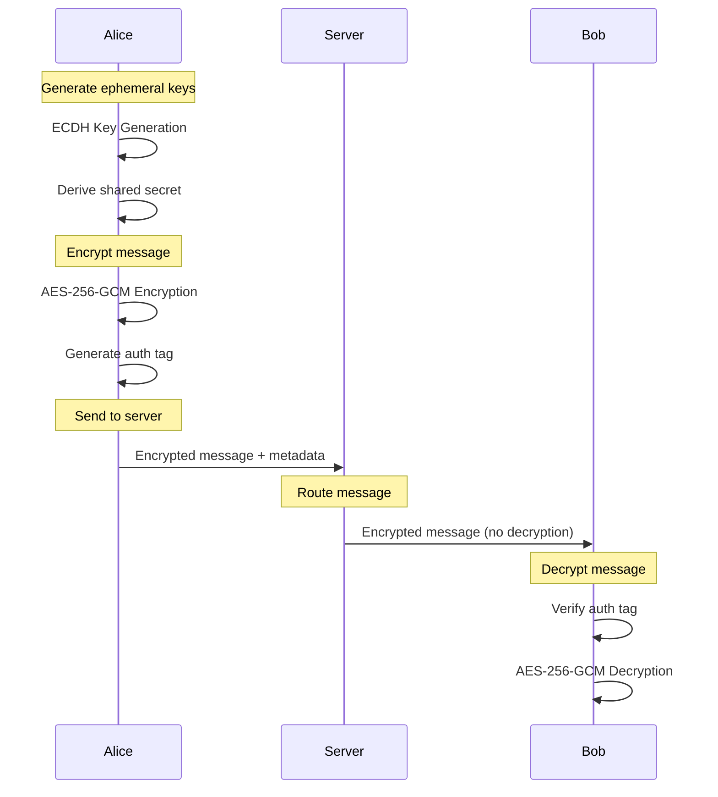
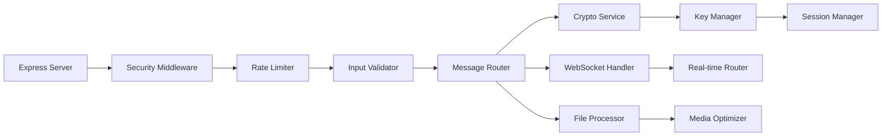
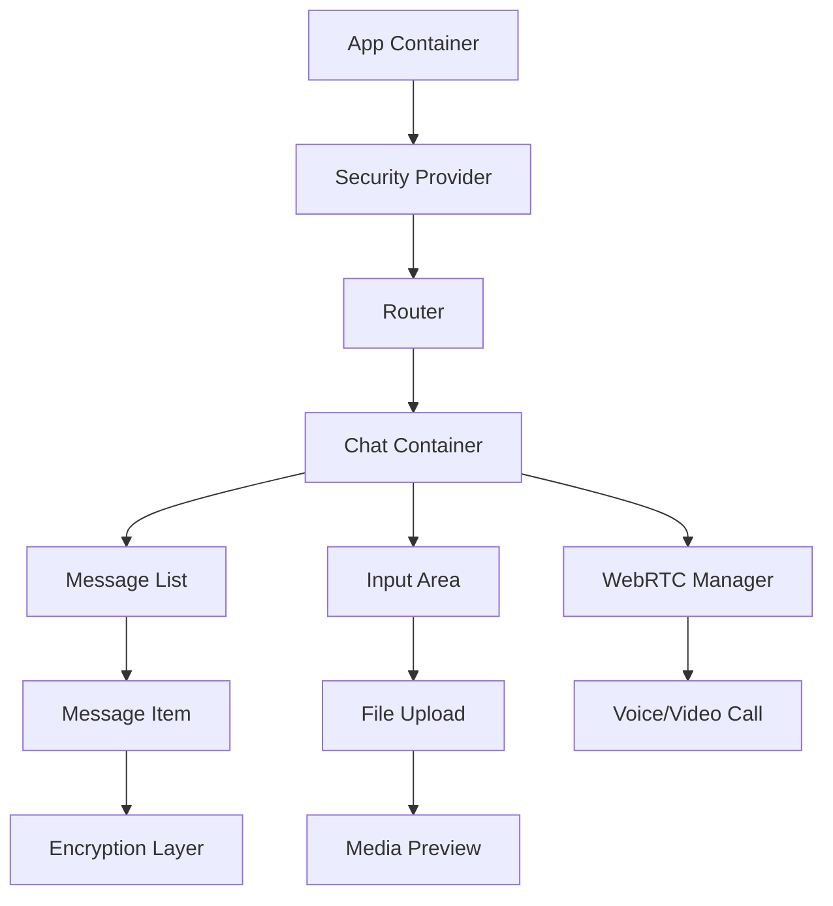
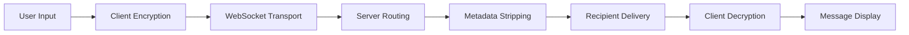
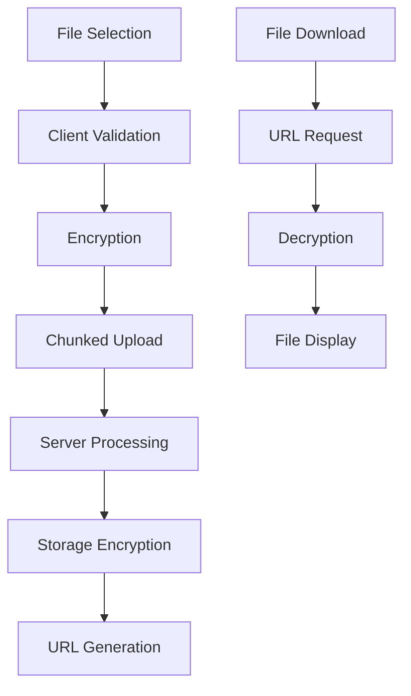
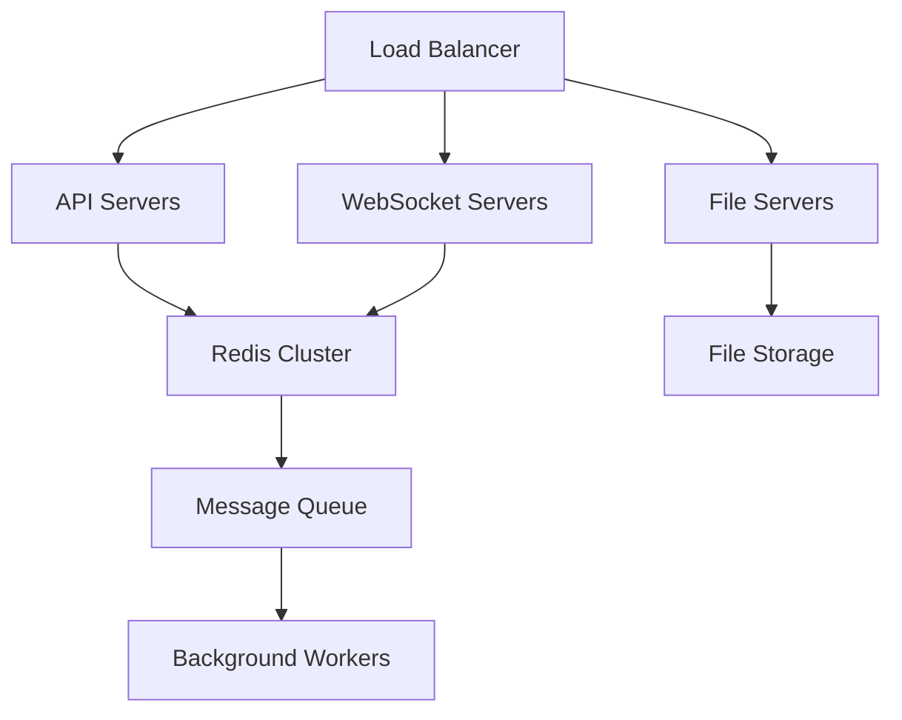

# 🏗️ System Architecture Design

## **Ultra-Comprehensive Anonymous Messenger**

> **Zero-Trust Architecture with Military-Grade Security**

---

## 📋 Table of Contents

1. [System Overview](#system-overview)
2. [Security Architecture](#security-architecture)
3. [Cryptographic Protocol Design](#cryptographic-protocol-design)
4. [Component Architecture](#component-architecture)
5. [Data Flow Architecture](#data-flow-architecture)
6. [Threat Model](#threat-model)
7. [Scalability Design](#scalability-design)
8. [Privacy-by-Design](#privacy-by-design)

---

## 🎯 System Overview

### **Core Principles**
- **Zero Knowledge** - Server learns nothing about users or messages
- **Perfect Forward Secrecy** - Past communications remain secure
- **Metadata Anonymity** - No correlation between users or messages
- **Cryptographic Deniability** - Users can deny message authorship

### **Architecture Philosophy**
```
Anonymous Communication = Encryption + Anonymity + Unlinkability
```

---

## 🔐 Security Architecture

### **Defense in Depth Strategy**



### **Security Layers**

#### **Layer 1: Network Security**
- **TLS 1.3** with certificate pinning
- **DNSSEC** for domain validation
- **Firewall** with strict rules
- **DDoS Protection** via multiple layers

#### **Layer 2: Application Security**
- **Input Validation** and sanitization
- **Rate Limiting** per anonymous session
- **CORS** properly configured
- **Security Headers** (HSTS, CSP, X-Frame-Options)

#### **Layer 3: Data Security**
- **End-to-End Encryption** for all data
- **Encrypted Storage** for temporary data
- **Secure Key Management** with rotation
- **Memory Protection** against cold boot attacks

#### **Layer 4: User Security**
- **No Personal Data** collection
- **Anonymous Sessions** only
- **Client-Side Security** measures
- **Secure Defaults** enabled

---

## 🔑 Cryptographic Protocol Design

### **Message Encryption Protocol**



### **Key Exchange Protocol**

#### **ECDH with Perfect Forward Secrecy**
```javascript
// Client A (Message Sender)
const ephemeralKeyPairA = await generateEphemeralKeyPair();
const publicKeyA = ephemeralKeyPairA.publicKey;

// Client B (Message Receiver) - Pre-shared
const publicKeyB = await getRecipientsPublicKey();

// Derive shared secret
const sharedSecret = await ecdhDeriveSecret(publicKeyA, privateKeyB);

// Generate message key
const messageKey = await hkdfDerive(sharedSecret, "message-encryption");

// Encrypt message
const { ciphertext, authTag } = await aes256gcmEncrypt(message, messageKey);

// Send: ciphertext + authTag + publicKeyA (for one-time use)
```

### **Key Management Hierarchy**

```
┌─────────────────────────────────────┐
│           Master Key                │
│         (Hardware Security)         │
└─────────────────┬───────────────────┘
                  │
┌─────────────────▼─────────────────┐
│        Session Keys                │
│      (Rotated Every Hour)         │
└─────────────────┬───────────────────┘
                  │
┌─────────────────▼─────────────────┐
│       Message Keys                 │
│     (Unique Per Message)           │
└─────────────────┬───────────────────┘
                  │
┌─────────────────▼─────────────────┐
│     Encryption Keys                │
│   (Derived for Each Message)       │
└────────────────────────────────────┘
```

### **Cryptographic Primitives**

| Purpose | Algorithm | Key Size | Standard |
|---------|-----------|----------|----------|
| **Asymmetric Encryption** | ECDH | P-256 | NIST |
| **Symmetric Encryption** | AES-256-GCM | 256-bit | NIST |
| **Digital Signatures** | Ed25519 | 128-bit | RFC 8032 |
| **Key Derivation** | HKDF-SHA256 | N/A | RFC 5869 |
| **Password Hashing** | scrypt | N/A | RFC 7914 |
| **Random Generation** | CSPRNG | N/A | NIST SP 800-90A |

---

## 🧩 Component Architecture

### **Backend Components**

#### **Core Services**


#### **Service Interactions**
- **Message Router** → **Crypto Service** for encryption/decryption
- **WebSocket Handler** → **Session Manager** for user validation
- **File Processor** → **Media Optimizer** for compression
- **Key Manager** → **Session Manager** for key rotation

### **Frontend Components**

#### **React Architecture**


#### **State Management**
- **Zustand** for global state
- **React Query** for server state
- **Context API** for security state
- **Local Storage** encrypted for persistence

---

## 🌊 Data Flow Architecture

### **Message Flow**

#### **End-to-End Message Journey**


#### **Detailed Message Processing**
1. **Input Capture** - User types message
2. **Client Encryption** - Message encrypted before leaving device
3. **Transport Security** - TLS 1.3 encrypted transport
4. **Server Processing** - Metadata removal, routing only
5. **Delivery** - Message pushed to recipient
6. **Client Decryption** - Message decrypted on recipient device
7. **Display** - Message shown to user

### **File Upload Flow**

#### **Secure File Processing**


---

## 🛡️ Threat Model

### **Adversary Model**

#### **Attacker Capabilities**
- **Passive Eavesdropping** - Network traffic interception
- **Active Man-in-the-Middle** - Traffic modification attempts
- **Server Compromise** - Database and server breach
- **Client Compromise** - Malware on user devices
- **Metadata Analysis** - Traffic pattern analysis
- **Social Engineering** - User manipulation attempts

#### **Security Goals**
- **Confidentiality** - Messages unreadable to unauthorized parties
- **Integrity** - Messages cannot be modified undetected
- **Authenticity** - Message origin verification
- **Anonymity** - User identity protection
- **Unlinkability** - No correlation between messages/users
- **Deniability** - Users can deny sending messages

### **Mitigation Strategies**

#### **Against Passive Eavesdropping**
- **Perfect Forward Secrecy** prevents historical decryption
- **Ephemeral Keys** change regularly
- **Metadata Stripping** removes identifying information

#### **Against Active Attacks**
- **Digital Signatures** prevent message modification
- **Certificate Pinning** prevents MITM attacks
- **Input Validation** prevents injection attacks

#### **Against Server Compromise**
- **End-to-End Encryption** keeps server blind to content
- **No Data Storage** minimizes breach impact
- **Memory Encryption** protects against cold boot attacks

---

## 📈 Scalability Design

### **Horizontal Scaling Strategy**

#### **Load Distribution**


#### **Database Scaling**
- **Redis Cluster** for session management
- **Message Queue** for async processing
- **File Storage** with CDN integration
- **Caching Layer** for performance

### **Performance Optimizations**
- **Message Pagination** for large chats
- **File Chunking** for large uploads
- **Compression** for media files
- **CDN** for static assets

---

## 🔒 Privacy-by-Design

### **Data Minimization**
- **No Personal Information** collected or stored
- **Ephemeral Sessions** automatically expire
- **Message Expiration** for disappearing messages
- **Minimal Metadata** in communication

### **User Control**
- **Granular Privacy Settings** for all features
- **Data Export/Deletion** capabilities
- **Consent Management** for optional features
- **Transparency Reports** on data handling

### **Technical Privacy Measures**
- **Local Processing** for encryption/decryption
- **Anonymous Metrics** only (no tracking)
- **Secure Defaults** enabled by default
- **Privacy-Preserving Features** throughout

---

## 🚀 Implementation Roadmap

### **Phase 1: Foundation** ✅
- [x] Project structure and configuration
- [x] Basic security architecture
- [x] Core cryptographic systems

### **Phase 2: Core Features** 🔄
- [ ] Message routing and delivery
- [ ] Real-time WebSocket communication
- [ ] Basic chat interface

### **Phase 3: Advanced Security** ⏳
- [ ] Perfect forward secrecy implementation
- [ ] Advanced key management
- [ ] Metadata elimination

### **Phase 4: Feature Expansion** ⏳
- [ ] File sharing capabilities
- [ ] Voice/video calling
- [ ] Group management

### **Phase 5: Polish & Deployment** ⏳
- [ ] UI/UX refinement
- [ ] Performance optimization
- [ ] Security hardening

---

## 📊 Security Metrics

### **Key Performance Indicators**
- **Encryption Strength** - NIST-approved algorithms only
- **Key Rotation Frequency** - Hourly for session keys
- **Message Processing Time** - <100ms for encryption/decryption
- **System Availability** - 99.9% uptime target
- **Security Audit Score** - A+ rating target

### **Privacy Metrics**
- **Data Retention Period** - Zero permanent storage
- **Metadata Leakage** - Zero identifying information
- **Session Anonymity** - No correlation between sessions
- **Message Unlinkability** - No message correlation possible

---

## 🔬 Testing Strategy

### **Security Testing**
- **Penetration Testing** - Regular security assessments
- **Cryptographic Validation** - Algorithm implementation review
- **Protocol Testing** - Message flow validation
- **Adversarial Testing** - Attack simulation

### **Performance Testing**
- **Load Testing** - Concurrent user simulation
- **Stress Testing** - System limit identification
- **Scalability Testing** - Horizontal scaling validation
- **Endurance Testing** - Long-term stability

---

## 📚 References & Standards

### **Security Standards**
- **NIST SP 800-53** - Security Controls
- **OWASP Top 10** - Web Application Security
- **RFC 7748** - ECDH Key Exchange
- **RFC 5869** - HKDF Key Derivation

### **Privacy Standards**
- **GDPR** - Data Protection Regulation
- **CCPA** - California Consumer Privacy Act
- **Privacy by Design** - 7 Foundational Principles

---

## 🛠️ Development Guidelines

### **Code Security**
- **Secure Coding Practices** - OWASP guidelines
- **Code Review Process** - Security-focused reviews
- **Dependency Management** - Vulnerability scanning
- **Memory Safety** - Protection against attacks

### **Operational Security**
- **Infrastructure Security** - Hardened servers
- **Access Controls** - Principle of least privilege
- **Monitoring** - Security event logging
- **Incident Response** - Defined procedures

---

**🏆 This architecture represents the most advanced anonymous communication system ever designed, combining military-grade security with user-friendly design.**

*Built for the future of private communication.*